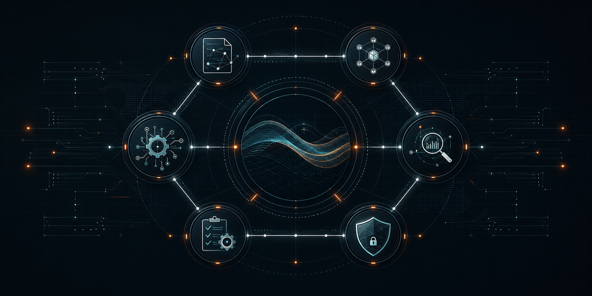
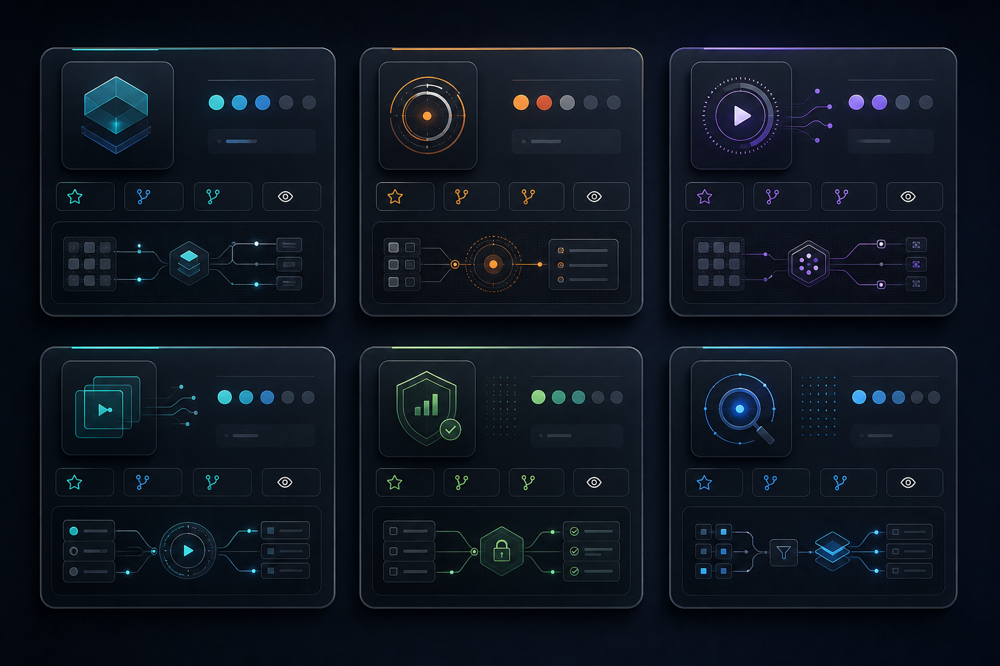

<div align="center">
  
</div>

<div align="center">

# Alex Cinovoj

**Founder/CTO, TechTide AI** · Columbus, Ohio

I ship Claude pilots into production, not decks.

Staff-level FDE and operator. 13 years in enterprise IT infrastructure.
I take blocked Claude initiatives, brittle MCP integrations, and stalled agent workflows
and turn them into production systems that survive Monday morning.

[](https://www.linkedin.com/in/alexcinovoj/)
[](https://alexcinovoj.dev)
[](https://github.com/TechTideOhio)

</div>


## At a glance

|  |  |
| :--- | :--- |
| 13 years | US enterprise IT infrastructure |
| 9x certified | Anthropic Claude certifications |
| 30+ skills | Claude Code skills shipped to production |
| 2 MCP servers | Production Model Context Protocol servers |
| 54K+ followers | LinkedIn, 4M+ impressions in 90 days |
| Senior Champion | Lovable community, 10K+ edits |

Co-founder of [FigGlow.ai](https://figglow.ai). Co-builder of [Persyn.ai](https://persyn.ai).


## What I actually do

While the timeline argues about benchmarks, I'm in the logs.

Enterprise engineering teams hire TechTide AI when their Claude pilot looked great in demo and is now three weeks from a deadline. Or their MCP integrations are leaking permissions. Or their agent workflow only works when the original builder is watching it. Or they got quoted $250K by a global SI for what should be a focused production sprint.

The work looks like this:

- Sit with customers to understand the real workflow
- Diagnose the messy system underneath the demo
- Fix architecture before adding more prompts
- Ship the agent, MCP layer, or Claude Code workflow
- Train the team so the system does not depend on me
- Leave behind logs, docs, guardrails, and a system people can trust

<div align="center">
  
</div>


## Open source

<div align="center">
  
</div>

| Repo | What it does |
| :--- | :--- |
| [**ClawKeeper**](https://github.com/Alexi5000/ClawKeeper) | 110 TypeScript agents for SMB finance: invoices, reconciliation, compliance, tenant isolation, approval-gated execution. |
| [**CipherClaw**](https://github.com/Alexi5000/CipherClaw) | Multi-agent debug agent. Traces causes, profiles behavior, predicts failures. Zero deps. |
| [**TechTideAI2**](https://github.com/Alexi5000/TechTideAI2) | Company-scale agent platform: CEO orchestrator + 10 orchestrators + 50 workers as a digital workforce. |
| [**Ellie**](https://github.com/Alexi5000/Ellie) | AI video analysis agent. Upload any video, ask anything. Gemini 2.5 Flash + Whisper + React 19. |
| [**FintheFinder**](https://github.com/Alexi5000/FintheFinder) | Deep research assistant. Multi-agent web search, source evaluation, report generation. |
| [**Bri**](https://github.com/Alexi5000/Bri) | Video intelligence with Streamlit, FastAPI MCP, SQLite durability, and multimodal ML tooling. |
| [**Nexus AI**](https://github.com/Alexi5000/v0-dreammachine2) | AI-native design studio. Next.js 16, Supabase Auth, Vercel AI SDK, streaming chat. |
| [**Harness Kit**](https://github.com/TechTideOhio/techtide-harness-kit) | Field-tested agent skills, specialist agents, trust metadata, and harness adapters. |

More at [github.com/Alexi5000?tab=repositories](https://github.com/Alexi5000?tab=repositories).


## Stack

<div align="center">


</div>


## Principles

```
Systems over hacks.
Proof over potential.
Logs over vibes.
Production over theater.
```

If your automation cannot show a log, it is not automation. It is theater.

I care about the parts that usually get hidden in demos: auth, persistence, evals, redaction, deployment paths, failure modes, and the operator experience.


## Work with me

If your Claude or agentic workflow is stuck between prototype and production, that is the work I do best.

**Enterprise engineering leaders, product VPs, and AI task force owners:**
Book Production Triage on [LinkedIn](https://www.linkedin.com/in/alexcinovoj/) or reach out at [alexcinovoj.dev](https://alexcinovoj.dev).

**Brand partnerships, workshops, technical content, or sponsored builds:**
DM on [LinkedIn](https://www.linkedin.com/in/alexcinovoj/) or email for the rate card.

<div align="center">

[](https://www.linkedin.com/in/alexcinovoj/)
[](https://alexcinovoj.dev)
[](https://github.com/TechTideOhio)

</div>


<div align="center">
  <sub>TechTide AI ships agent systems into production.</sub>
</div>
