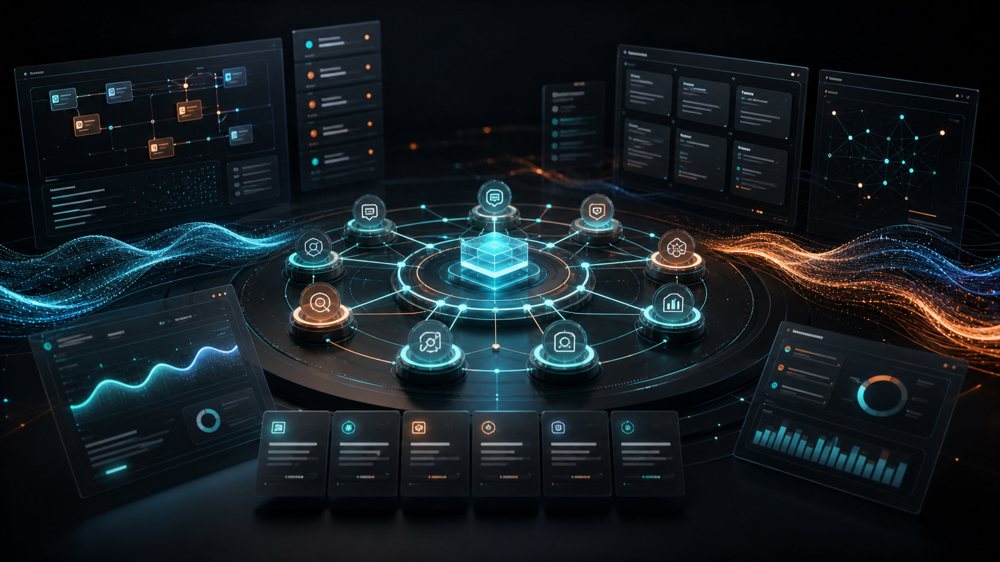

<div align="center">
  
</div>

<div align="center">

# Alex Cinovoj

**I take blocked Claude initiatives to production.**

Founder & CTO, [TechTide AI](https://techtideai.io) · Columbus, OH

[](https://www.linkedin.com/in/alexcinovoj/)
[](https://techtideai.io)
[](https://alexcinovoj.com)

</div>


<div align="center">


</div>

<div align="center">


</div>


## Production work

### Active products

| Product | What it is |
| :--- | :--- |
| [**ClawLi.ai**](https://clawli.ai) | LinkedIn CRM with agent-driven outreach and pipeline management. |
| [**FigGlow.ai**](https://figglow.ai) | Carousel SaaS for social content at scale. Co-founded with Shane Spencer. |

### Open source

| Repo | What it does |
| :--- | :--- |
| [**TechTide Swarm 357**](https://github.com/Alexi5000/TechTideAI2) | Multi-agent orchestrator. CEO + domain leads + specialized workers as a digital workforce. |
| [**Bri**](https://github.com/Alexi5000/Bri) | Video intelligence agent. Streamlit, FastAPI MCP, SQLite durability, multimodal ML. |
| [**Ellie**](https://github.com/Alexi5000/Ellie) | AI video analysis agent. Upload video, ask anything. Gemini 2.5 Flash + Whisper + React 19. |
| [**WildScape-Europe**](https://github.com/Alexi5000/WildScape-Europe) | European wildlife tracking and conservation data platform. |
| [**FintheFinder**](https://github.com/Alexi5000/FintheFinder) | Deep research assistant. Multi-agent web search, source evaluation, report generation. |
| [**ClawKeeper**](https://github.com/Alexi5000/ClawKeeper) | 110 TypeScript agents for SMB finance. Invoices, reconciliation, compliance, approval-gated execution. |
| [**CipherClaw**](https://github.com/Alexi5000/CipherClaw) | OpenClaw debug agent. Traces causes, profiles behavior, predicts failures. Zero deps. |


## Manifesto

```
Systems over hacks.
Proof over potential.
Embedded agents over flashy demos.
```

If your automation cannot show a log, it is not automation — it is theater.

50% of AI pilots fail at the org layer. We rescue the half worth saving and refuse the rest.


## Shipping now

- **TechTide AI** — client engagements: Production Triage, Workflow Rescue, Fractional FDE
- **ClawLi.ai** — LinkedIn CRM
- **TechTide Swarm 357** — multi-agent orchestration framework

*Updated quarterly.*


## Podcast & community

- [**Automation Vibes**](https://automationvibes.ai) — podcast + newsletter with Shane Spencer
- **Lovable Community Discord** — Senior Champion, 10K+ verified edits across 277 active days
- **Anthropic Partner Network** — services partner


## Work with me

**Production Triage available.** Book in the [Featured section on LinkedIn](https://www.linkedin.com/in/alexcinovoj/) or at [techtideai.io](https://techtideai.io).

<div align="center">

[](https://www.linkedin.com/in/alexcinovoj/)
[](https://techtideai.io)
[](https://alexcinovoj.com)
[](mailto:alex@techtideai.io)

</div>


<div align="center">
  <sub>50+ concurrent worker nodes in production · 9× Anthropic Academy · 30+ Claude Code skills · Lovable Senior Champion · 13 yrs US enterprise IT</sub>
</div>
