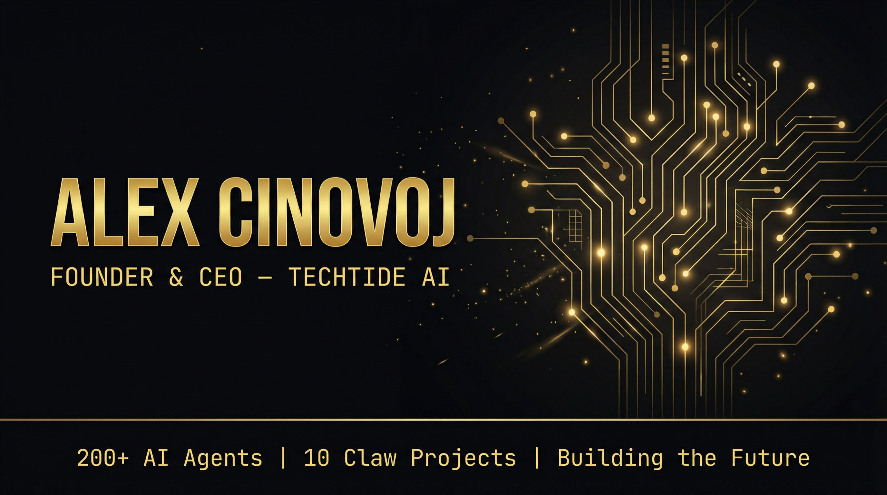
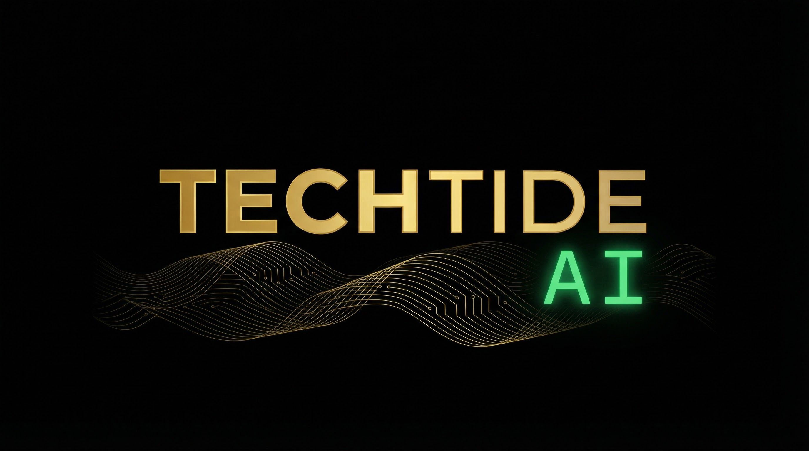
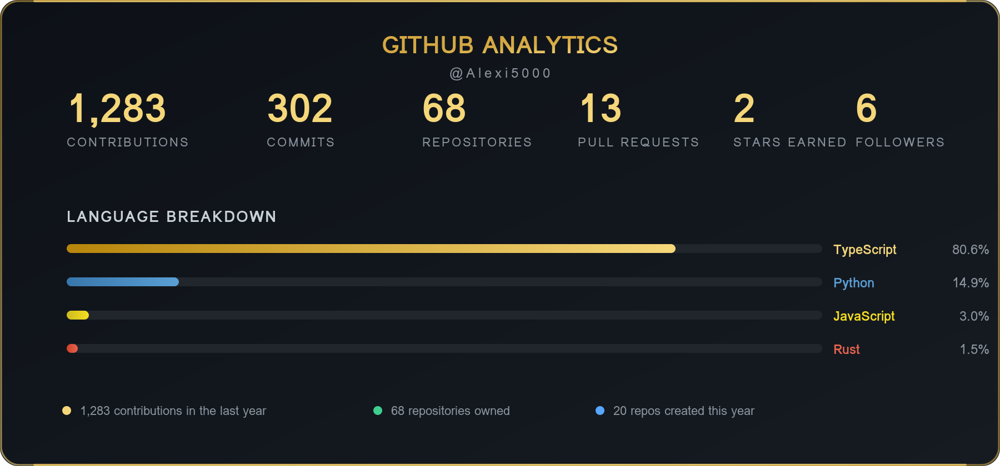
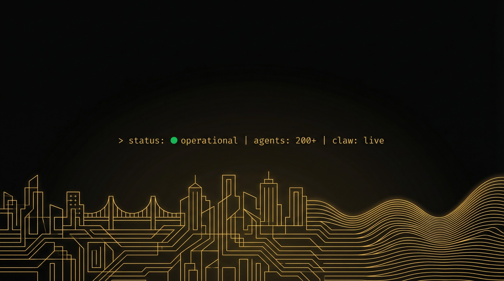

<!-- HEADER BANNER -->

  

<!-- LOGOS -->

  
  &nbsp;&nbsp;&nbsp;&nbsp;
  

 

<!-- TECH BADGES -->

> Building AI-powered platforms and multi-agent systems at full speed. I ship products that put autonomous agents to work — from company-scale AI workforces to intelligent bookkeeping to real-time dispatch systems.

## 🚀 Featured Projects

- 🌍 **[WildScape-Europe](https://github.com/Alexi5000/WildScape-Europe)** - Discover wild camping across Europe — 3D terrain maps, real-time weather, and 500+ curated campsites from Norway's fjords to the Swiss Alps
- 🧠 **[Bri](https://github.com/Alexi5000/Bri)** - Your empathetic AI video analysis agent — upload a video, ask anything. Frame captioning, audio transcription, object detection, and conversational memory
- 🏢 **[TechTideAI2](https://github.com/Alexi5000/TechTideAI2)** - Company-scale AI agent platform — CEO + 10 orchestrators + 50 workers operating as a fully autonomous digital workforce
- 📚 **[ClawKeeper](https://github.com/Alexi5000/ClawKeeper)** - Autonomous AI bookkeeping for SMBs — 110 AI agents handle invoices, reconciliation, and financial reporting so you never touch a spreadsheet again
- 🔍 **[CipherClaw](https://github.com/Alexi5000/CipherClaw)** - An OpenClaw debug agent that traces causes, profiles behavior, and predicts failures in multi-agent systems. Zero deps. Plug and play
- 🚗 **[yuberapp1](https://github.com/Alexi5000/yuberapp1)** - The Uber for home emergencies — AI-powered dispatch that finds the nearest pro, sends them to you, and tracks the job in real-time

### 🏗️ TechTide Ecosystem (Private)

- 🎯 **[TechTide Command Center](https://github.com/Alexi5000/techtidecc)** - Multi-tenant LinkedIn CMS + CRM + AI Agent platform
- 🔮 **[Constellation](https://github.com/Alexi5000/Constellation)** - TechTide Multi-Agent Orchestration Framework
- 📈 **[content-studio-platform](https://github.com/Alexi5000/content-studio-platform)** - Autonomous agent-driven dashboard for posting content to 13+ social media platforms
- 🧬 **[evolvium](https://github.com/Alexi5000/evolvium)** - Multi-agent collaborative coding platform

## 📊 GitHub Analytics & Activity

  

## 🔗 Connect

<!-- FOOTER BANNER -->

  

