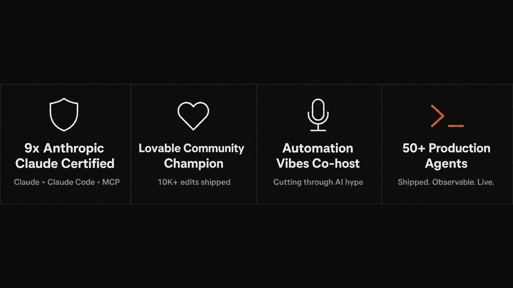
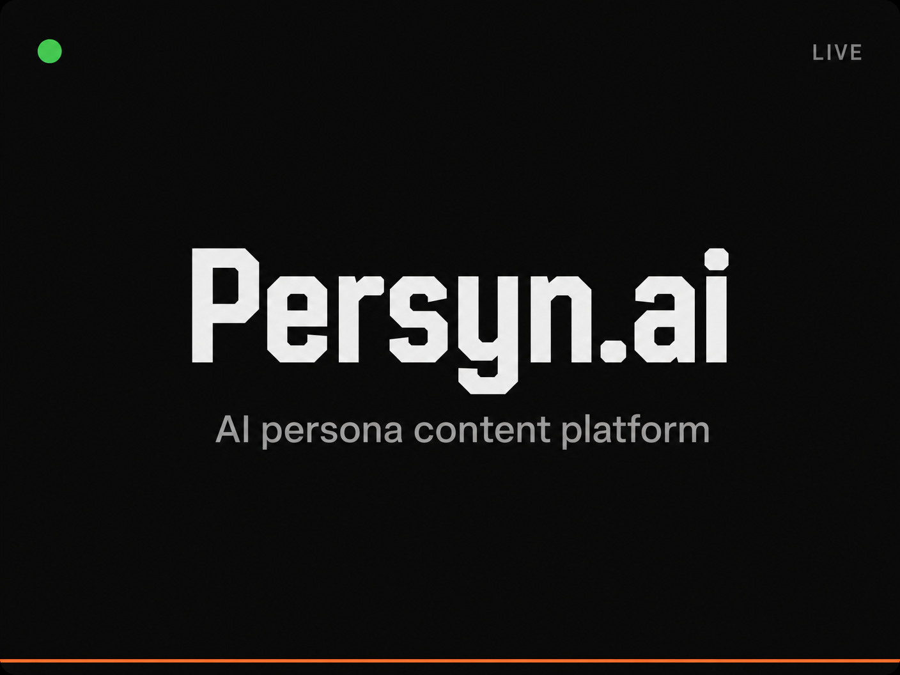
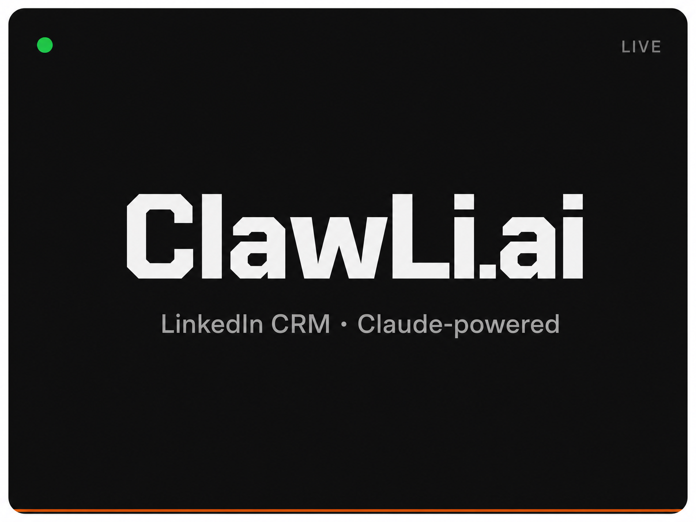
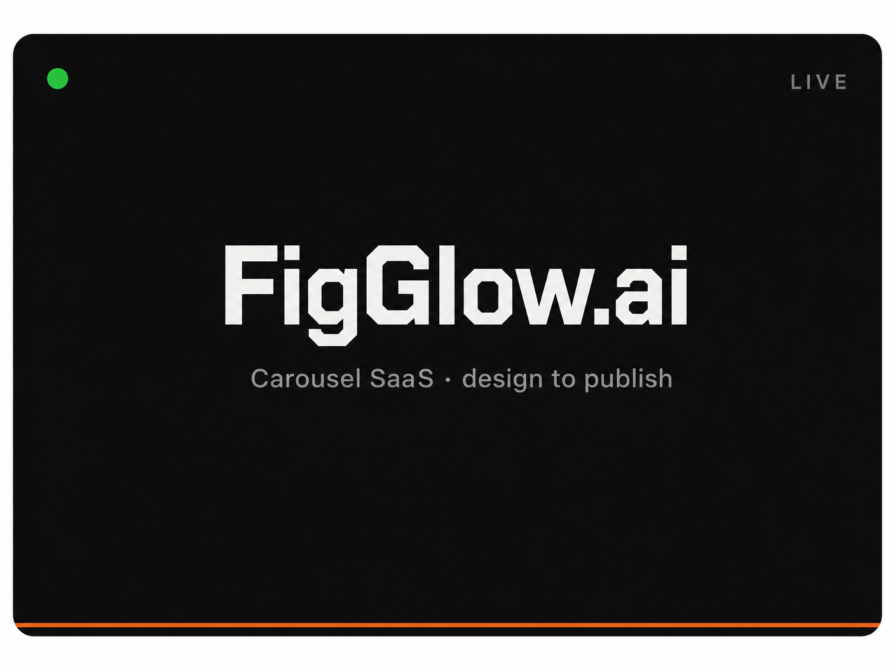

<!-- HEADER BANNER -->
<div align="center">
  
</div>


<!-- CREDENTIAL CARDS -->
<div align="center">
  
</div>


<!-- TECH STACK -->
<div align="center">


</div>


## Featured Production Work

<div align="center">
<a href="https://persyn.ai"></a>&nbsp;<a href="https://clawli.ai"></a>&nbsp;<a href="https://figglow.ai"></a>
</div>

<br>

**Open-source & portfolio**

| Repo | Description |
|---|---|
| [**TechTide Swarm 357**](https://github.com/Alexi5000/TechTideAI2) | Multi-agent orchestration — 357 agents, one observable system |
| [**Bri**](https://github.com/Alexi5000/Bri) | Conversational agent scaffold on Claude + MCP — video analysis, memory, transcription |
| [**WildScape-Europe**](https://github.com/Alexi5000/WildScape-Europe) | Geospatial AI pipeline — 3D terrain, real-time weather, 500+ curated campsites |
| [**CipherClaw**](https://github.com/Alexi5000/CipherClaw) | OpenClaw debug agent — traces causes, profiles behavior, predicts failures |
| [**ClawKeeper**](https://github.com/Alexi5000/ClawKeeper) | Autonomous AI bookkeeping — 110 agents handle invoices, reconciliation, reporting |


## Manifesto

```
Systems over hacks.
Proof over potential.
Embedded agents over flashy demos.
```

*If your automation can't show a log, it isn't automation — it's theater.*


## What I'm Shipping Right Now

> Updated quarterly. No vaporware.

- **TechTide AI client engagements** — Unblocking Claude initiatives for teams stuck between prototype and production
- **Persyn.ai** — Expanding persona depth and multi-channel publishing
- **ClawLi.ai** — Agent-driven relationship scoring and outreach sequencing
- **TechTide Swarm 357** — Open-sourcing the orchestration layer, docs in progress


## Podcast & Community

<div align="center">

[](https://automationvibes.com)
&nbsp;&nbsp;
[](https://lovable.dev/community)

</div>

**Automation Vibes** — cutting through AI hype to talk about what actually ships. Real systems, real logs, real outcomes.

**Lovable Community** — 10K+ edits in. If you're building with Lovable and hitting walls, find me there.


## Work With Me

**Production Triage is available.**

If your team has a Claude initiative that's blocked — stuck in prototype, failing in prod, or not observable enough to trust — that's the problem I solve.

> Book **Production Triage** via the Featured section on my [LinkedIn profile](https://www.linkedin.com/in/alexcinovoj/).

<div align="center">

<a href="https://www.linkedin.com/in/alexcinovoj/"></a>
&nbsp;
<a href="https://alexcinovoj.dev"></a>
&nbsp;
<a href="https://twitter.com/alexcinovoj"></a>
&nbsp;
<a href="https://github.com/Alexi5000"></a>

</div>


<!-- FOOTER BANNER -->
<div align="center">
  
</div>
